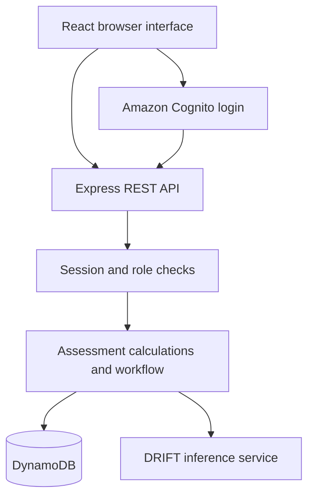

# StratSight

Healthcare Strategic Decision Support

**Author:** Gilbert Acquaye  
**Course:** SWENG 861, Software Construction

## Project overview

StratSight helps healthcare financial analysts evaluate sample service-line opportunities. Analysts enter annual volume, capacity, revenue, cost, and investment assumptions. The backend calculates strategic indicators and stores assessments for leadership review.

This capstone uses a separate repository from the weekly assignments. It reuses their authentication, API, testing, and observability patterns and adds healthcare assessment calculations and a leadership workflow.

## Requirements and success criteria

| Requirement | Success criterion |
|---|---|
| Authentication | Cognito login creates a browser session. Unauthenticated API requests return 401. |
| Role access | The backend reads Analyst, Director, or Executive from the user table. Restricted actions reject unauthorized roles. |
| Assessment CRUD | Analysts create, retrieve, edit, and delete their own editable assessments. |
| Calculations | The server validates seven numeric inputs and calculates the documented indicators. |
| Dashboard | The detail page displays saved inputs and calculated metrics. |
| Leadership workflow | An analyst submits. A different Director or Executive approves or returns with a comment. |
| Status/history | Submitted and approved assessments are locked. History records actions, actor, time, and review comments. |
| AI interpretation | DRIFT interprets server-calculated metrics. Live generation and persistence after refresh were verified on October 9, 2026. |
| Reliability | Conditional writes return 409 when a conflicting update occurs. The list route handles DynamoDB pagination. |
| Data scope | Demonstrations use sample, non-sensitive business data. No patient information or PHI. |

No quantitative performance target has been measured. The application is a course prototype.

## Architecture

React provides the browser interface. Express runs the API, session authentication, authorization, calculations, and workflow. DynamoDB stores users and assessments. Cognito provides identity. DRIFT is an external inference service.



The backend deploys as one application with utility modules, rather than microservices. Its current route handlers remain in `backend/app.js`. Extracting routes and repositories into dedicated modules is future work.

### Key files

- `backend/app.js`: server, authentication, roles, API routes, workflow, conditional persistence.
- `backend/utils/assessmentMetrics.js`: pure numeric validation and calculations.
- `backend/utils/insightUtils.js`: shared insight validation and record creation.
- `backend/utils/driftClient.js`: DRIFT request client using the instructor-issued credential.
- `backend/observability.js`: request logging and metrics.
- `backend/tests/`: Jest and Supertest backend tests.
- `frontend/src/App.jsx`: React pages, assessment forms, dashboard, leadership review.
- `frontend/src/apiClient.js`: authenticated JSON requests.

### Data model

`StratSightUsers` uses a string partition key `userId`. The Cognito subject provides a stable user identifier. Login defaults a new role to Analyst without overwriting an existing role.

`StratSightAssessments` uses a string partition key `insightId`. This legacy key and the `/api/insights` route names support reuse of the weekly implementation. Records include owner, title, description, category, status, input assumptions, metrics, timestamps, and history. The DRIFT integration stores interpretation text, source, and generation time. Editing clears the old interpretation.

### Workflow

Draft and Returned assessments are editable by their Analyst owner. Submission requires complete valid inputs. Submitted assessments can be reviewed by a different Director or Executive. A review requires a comment and changes status to Approved or Returned. Approved assessments remain locked. The API controls workflow status, ignoring client attempts to set approval through ordinary edits.

## Documented stack changes

| Original proposal | Current implementation | Reason |
|---|---|---|
| MongoDB and Mongoose | DynamoDB and AWS SDK | Reuse the working cloud persistence pattern and retain separate capstone tables. |
| Planned secure authentication | Amazon Cognito OIDC and express-session | Reuse verified login and stable user identity. The browser uses a session cookie. |
| React, JavaScript, Node.js, Express | Retained | Existing frontend/backend foundation fits the application. |
| Jest and Supertest | Retained | Test calculations, access rules, and workflow responses. |
| DRIFT inference API | Implemented and verified | Use the instructor-provided endpoint and request contract. |

The instructor does not require approval for changes to the proposed stack. This table documents the implementation choices. Docker and GitHub Actions configuration inherited from weekly work must be validated in the capstone before claiming a successful capstone build or deployment.

## Local setup

### Prerequisites

- Node.js and npm compatible with the repository's package lock. The copied Dockerfile uses Node 24.
- AWS credentials with access to the capstone DynamoDB tables in `us-east-2`.
- A Cognito user pool/app client configured for the existing login callback.
- Two sample user accounts to demonstrate Analyst and Director review.

From the repository root:

```powershell
npm ci
```

In a second terminal:

```powershell
cd frontend
npm ci
npm run dev
```

Create `backend/.env` privately with your configuration. Do not commit it. Use a non-secret `.env.example` to document variable names.

```dotenv
PORT=3000
AWS_REGION=us-east-2
DYNAMODB_USERS_TABLE=StratSightUsers
DYNAMODB_INSIGHTS_TABLE=StratSightAssessments
SESSION_SECRET=REPLACE_WITH_A_LONG_RANDOM_SECRET
COGNITO_USER_POOL_ID=REPLACE_WITH_POOL_ID
COGNITO_CLIENT_ID=REPLACE_WITH_CLIENT_ID
COGNITO_CLIENT_SECRET=REPLACE_WITH_CLIENT_SECRET_IF_REQUIRED
COGNITO_CALLBACK_URL=http://localhost:3000/
COGNITO_DOMAIN=REPLACE_WITH_CONFIGURED_COGNITO_DOMAIN
COGNITO_LOGOUT_URL=REPLACE_WITH_REGISTERED_LOGOUT_URL
DRIFT_BASE_URL=http://ec2-13-59-66-30.us-east-2.compute.amazonaws.com:8091
DRIFT_MODEL=drift
DRIFT_API_KEY=REPLACE_WITH_YOUR_PRIVATE_KEY
```

Set the Cognito values to match your app client and registered callback/logout URLs. Configure AWS credentials through your normal AWS credential provider, such as a local profile. Never commit AWS keys. Do not run the development server with `NODE_ENV=test`, which enables test-only identity headers.

Create the two tables with the partition keys above. The backend identity needs GetItem and UpdateItem for the user table and Scan, GetItem, PutItem, UpdateItem, and DeleteItem for the assessment table. Scope access to the required table ARNs.

From the repository root, start the backend:

```powershell
node backend/app.js
```

Open `http://localhost:5173`. The health endpoint is `http://localhost:3000/health` and metrics are at `/metrics`. A backend restart clears the development in-memory sessions, so log in again. If port 3000 is occupied by the weekly Docker container, stop that container before starting StratSight.

### Roles

Log in with each sample account once. In DynamoDB, keep the analyst record's role as `Analyst` and set the second account's role to `Director`. Refresh the browser after changing roles. No public role-assignment endpoint exists.

### Docker deployment story

The inherited Dockerfile packages the backend. It does not package the React frontend. A local Docker demonstration therefore runs the frontend with Vite separately and supplies backend environment configuration at runtime. The capstone Docker build and Cognito callback behavior require verification before presenting them as complete. Local execution above is the currently verified startup path.

## Metrics and sample data

All volumes cover one year. Inputs must be finite nonnegative numbers. Annual capacity must exceed zero.

| Indicator | Formula |
|---|---|
| Incremental volume | Projected volume minus current volume |
| Volume growth percent | Incremental volume / current volume × 100; null if current volume is zero |
| Capacity utilization percent | Projected volume / annual capacity × 100 |
| Capacity gap | Maximum of zero and projected volume minus annual capacity |
| Contribution per case | Net revenue per case minus variable cost per case |
| Incremental annual contribution | Incremental volume × contribution per case minus additional annual fixed cost |
| Simple payback years | Initial investment / incremental annual contribution; null if contribution is nonpositive, except zero investment returns zero |

Sample inputs: current volume 1000, projected volume 1200, capacity 1500, revenue per case $500, variable cost $300, added annual fixed cost $10,000, investment $60,000.

Expected outputs: incremental volume 200, growth 20%, utilization 80%, capacity gap 0, contribution per case $200, annual contribution $30,000, payback 2 years. Changing projected volume to 1300 gives $50,000 annual contribution and 1.2 years payback.

Simple payback excludes discounting and assumes constant annual contribution. These estimates do not establish market demand or investment approval.

## Tests and current evidence

From the project root:

```powershell
npm test -- --silent
npm run test:coverage
```

As reported in the local run on October 9, 2026, **42 backend tests across five suites passed**. Suites cover authentication, existing API integration, insight utilities, assessment calculations, and the leadership workflow. Integration tests mock DynamoDB rather than proving live AWS permissions. Coverage percentage has not been recorded for the current version.

Frontend verification:

```powershell
cd frontend
npm run build
```

The frontend production build succeeded on October 9, 2026 (26 modules transformed). A frontend test-suite result has not been reported. A successful build does not replace browser testing.

Live browser checks confirmed login, creation, metrics, editing, the two-account submit/return/revise/resubmit/approve workflow, and DRIFT generation with persistence after refresh. These checks are separate from the mocked backend tests.

## DRIFT integration

The backend calls `/v1/chat/completions` with model `drift`, `stream: false`, `max_tokens: 200`, `temperature: 0`, and `drift_debug: false`. The key stays in `backend/.env`. Responses require human validation. A Groq client was used temporarily while awaiting the credential and is retained as a backup; the final demonstrated provider is DRIFT. There is no automatic provider failover.

## Demo

1. Log in as Analyst and show the role.
2. Create the sample expansion assessment.
3. Explain volume, capacity, annual contribution, and simple payback.
4. Edit projected volume to 1300 and show recalculated outputs.
5. Generate DRIFT interpretation and refresh to demonstrate persistence.
6. Submit for review and show the editing lock.
7. Log in as Director, return with a comment, then show analyst revision/resubmission.
8. Approve as Director and inspect history.
9. Show the backend test summary and selected code modules.

## Limitations and future work

- DRIFT generation can take longer than 30 seconds. The client allows up to 120 seconds with a 200-token request. Its instructor-provided endpoint uses HTTP. A production integration should use protected transport.
- Sessions use a development memory store and non-secure localhost cookies. Production needs persistent sessions, HTTPS, and additional session/CSRF hardening.
- Role management currently uses controlled DynamoDB edits.
- DynamoDB scans suit this small prototype. A production system should use suitable keys/indexes for owner and review queues.
- Refactor route handlers, add measured performance goals, and broaden browser tests.
- Add sensitivity analysis, market evidence, and discounted investment indicators with validated requirements.

## AI-assisted development

AI supported scaffolding, code review, tests, and documentation. The developer validated generated behavior and corrected mistakes, including DynamoDB reserved-name aliases and legacy API response regressions. The passing tests and live demo provide evidence of the audited implementation. The developer remains responsible for explaining and maintaining the code.
